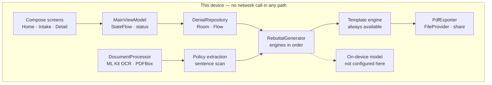

# DenialShield

**A denial letter goes in. The appeal comes out.**

[](https://github.com/nikolareljin/denial-shield/actions/workflows/android-apk.yml)
[](https://github.com/nikolareljin/denial-shield/actions/workflows/security-scan.yml)
[](https://github.com/nikolareljin/denial-shield/actions/workflows/gitleaks-scan.yml)

An Android app that photographs a health-insurance denial letter, reads it on the
device, pulls out the claim number, the stated reason and the policy language the
insurer cites, and drafts the appeal letter back. No account, no server, no upload.

**[nikolareljin.github.io/denial-shield](https://nikolareljin.github.io/denial-shield/)** — walkthrough, architecture, and how it is built.

## Disclaimer

DenialShield does not provide legal, medical, or other advice to any patient or
insurer. This repository is a public showcase build and should not be used in
real-world scenarios. Use at your own risk; the authors accept no responsibility
or liability for any use of this software.

## What this build is

Drafting runs through the **template engine**: it fills a fixed appeal structure
from the captured claim and leaves bracketed placeholders where a person has to
write the rest. The on-device model path is present as an interface and is not
configured here.

Document capture, OCR, PDF extraction, policy-language extraction, storage and
export are the real implementations and run as described.

A production implementation exists — contact the author about requirements.

## The pipeline

Five stages, all of them local. Nothing in this chain opens a socket, which is
what makes the privacy claim checkable rather than promised.

| | Stage | What runs |
| --- | --- | --- |
| 01 | **Capture** | Camera, gallery or file picker — a denial arrives as paper, a screenshot, or a PDF in email |
| 02 | **Recognize** | ML Kit text recognition for images, PDFBox for embedded PDF text; large captures are subsampled before decode |
| 03 | **Extract** | Sentence-level scan for the vocabulary that carries meaning in a denial — coverage, exclusion, medical necessity, prior authorization |
| 04 | **Draft** | Engines tried in preference order; one that cannot run here declines and the next answers |
| 05 | **Export** | Rendered to PDF and handed to the share sheet through a scoped content URI |

## Architecture



`RebuttalEngine` returns either `Generated` or `Unavailable(reason)`, so an engine
that cannot run on a given device declines instead of throwing and the caller
falls through to the next one. The user always ends up with a letter, and the
draft is labelled with the engine that wrote it.

## Walkthrough

Disclaimer on first launch, then the claim list:


Enter your details and the denied claim:


Photograph or upload the denial letter — it is read on the device:


Processing, then the drafted appeal — copy it, or export it as a PDF:


Submission is manual: the letter goes out through your own email or post.

## Tech stack

- **Jetpack Compose** — UI
- **Room** — local persistence, `Flow`-backed
- **ML Kit** — on-device text recognition
- **PDFBox-Android** — PDF text extraction and PDF rendering
- **Kotlin Coroutines & Flow** — asynchronous processing, reactive UI

## Build and install

```bash
./gradlew assembleDebug
adb install app/build/outputs/apk/debug/app-debug.apk
```

Or open the project in Android Studio (Ladybug or newer) and run.

Every push to `main` publishes a demo APK as the `latest` release asset:
<https://github.com/nikolareljin/denial-shield/releases/download/latest/denial-shield-demo.apk>

For details, see the [Usage Guide](docs/usage.md), [Build Guide](docs/build.md)
and [Release Guide](docs/release.md).

## How it is built and kept

Shared workflows live in a separate library and are consumed by every repository,
each pinned to a **commit SHA** rather than a tag — a tag can be force-moved, and
these jobs hold signing secrets.

- `pr-gate` — lint, test, build; cancels superseded runs, skips docs-only changes
- `ci` — the same three on every push to `main`
- `android-apk` — release build, signed when the keystore secret exists, debug-signed when it does not
- `security-scan` — Trivy, SARIF uploaded to the Security tab (skipped for fork PRs, whose token cannot write it)
- `gitleaks-scan` — full history, `fetch-depth: 0`; a shallow clone would miss a secret that was committed and later removed
- `pages` — deploys the site in `docs/website/`

## License

Proprietary. See [LICENSE](LICENSE).

- **Commercial use**: only the Creator (**Nikola Reljin**) is authorized to use
  this software for commercial purposes. All other commercial use is prohibited.
- **Modifications**: not permitted without prior written consent from the Creator.

---

## Clone traffic


_Updated daily. Total and unique cloners over the last 14 days._
